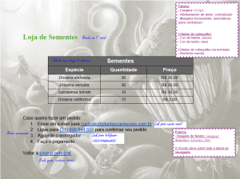

<<<<<<< HEAD
# Plantas Carnívoras 🦖

Um site informativo sobre plantas carnívoras.

## Atividade

Você tem um novo hobby: **criar plantas carnívoras**. Você encontrou um
documento solto em um antigo livro do seu tio Epaminondas e, depois de lê-lo,
decidiu **criar uma página web com seu conteúdo**. Além disso, você também tem
uma **pequena loja de sementes** dessas plantas e deseja divulgá-la em uma
página web.


### Exercício 1


Você deve pegar o documento do seu tio (arquivo:
`/documentos-do-tio/pagina-inicial-specs.pdf`) e criar uma página web com o
mesmo conteúdo e formatação. Observe que é possível abrir o PDF para
copiar/colar o texto (não perca tempo digitando =). Salve o arquivo como 
`index.html` (ver [FAQ](#faq)).
  - A pasta `/imagens` contém os arquivos de imagens a serem usados.


Você pode ver todas as _tags_ que precisará nos slides da aula. Veja
algumas diretrizes úteis para você marcar o texto sobre as plantas
carnívoras do tio Epaminondas:

- Termos **em latim** (exceto nomes próprios) devem estar
  enfatizados (há uma _tag_ para texto enfatizado).
- **Citações**, que estão em inglês, devem aparecer em itálico 
  (há duas _tags_ para citação, e você deve estilizá-las para que
  elas façam o texto ficar em itálico em vez de usar a mesma 
  _tag_ dos termos em latim). Veja no [FAQ](#faq) a propriedade para
  deixar o texto em itálico.
- Há um parágrafo "Você Sabia?" que deve ser estilizado de maneira distinta.
  Para estilizar 1 único elemento de maneira distinta, podemos atribuir um
  atributo `id="identificador-do-element"` nele. Veja no [FAQ](#faq).


### Exercício 2




Criar a página da loja seguindo o modelo do arquivo  
`/documentos-do-tio/pagina-loja-specs.pdf`. Depois de criada, salve o arquivo
como `loja.html`. Você deve também criar um hyperlink da página `index.html`
para sua nova `loja.html`, e vice-versa.


### Exercício 3

Agora que você já criou as duas páginas e estilizou as duas, deve ter
criado regras de formatação em CSS dentro de elementos `<style></style>`
nas duas páginas.

Para evitar repetição de código, é possível escrever código CSS em um arquivo
separado e incluí-lo em cada arquivo html. Isso se chama **refatorar**:

- Em vez de:
  ```html
    ...
    <style>
      ...
    </style>
  </head>
  ```
- Você pode:
  ```html
  <link rel="stylesheet" href="arquivo-de-estilos.css">
  ```

- E mover suas regras CSS **dentro de** `<style>` para o novo `arquivo-de-estilos.css`.

Note que, caso existam regras que só se apliquem a uma página, e não às duas,
você deve criar outro(s) arquivo(s) CSS para conter apenas as regras
exclusivas de cada página. Por exemplo, considere esta estrutura de pasta:
  - `cefet-web-piranha-plant`
    - `images`
      - `...`
    - `css`
      - `estilos-comuns.css`
      - `estilos-plantas.css`
      - `estilos-loja.css`
    - `...`


## FAQ

- Por que `index.html`?
  - Esse nome é especial e indica a página inicial de um site. Ou seja,
    se o usuário não especificar um arquivo (ao digitar, por exemplo,
    `fegemo.github.io/cefet-web/`), o servidor procura por um arquivo com esse
    nome.
- Qual a propriedade CSS para deixar um **texto em itálico**?
  - É a `font-style`, com os valores:
    ```css
    font-style: italic; /* itálico */
    font-style: normal; /* sem itálico, valor padrão */
    ```
- Posso usar a **_tag_ `<em></em>`** para deixar as coisas em itálico?
  - Essa não é a ideia. A _tag_ `<em></em>` serve para **marcar texto que**, de
    alguma forma, **possui ênfase**. Por um acaso, o padrão dos navegadores é renderizá-los em itálico.
  - A `<em></em>` deve ser usada com semântica (eg, "todos os termos em latim")
- Qual **_tag_ de citação** devo usar?
  - Veja nos slides sobre as [_tags_ de citação][tags-de-listas])
  - Há citações que ocorrem no meio de uma frase (chamamos isso de `inline`) e
    outras que são grandes e precisam ficar separadas do parágrafo (chamamos
    isso de `block`):
    - Citação `inline`: usamos `<q>texto citado</q>`
    - Citação `block`: usamos `<blockquote>texto citado</blockquote>`
- Os **links para seções internas** da página não estão funcionando.
  - Links internos (do tipo `<a href="#secao-jaula">jaula</a>`) apontam para
    algum elemento da página que possua um atributo `id` (identificador)
    igual ao texto que está à direita da `#` do link 
    ([slides sobre `id`][id-de-um-elemento]):
    ```html
    <a href="#secao-jaula">jaula</a>
    <!-- outros elementos da página... -->
    <h2 id="secao-jaula">Armadilhas jaula</h2>
    ```
- Como **estilizar apenas 1 parágrafo** (e não todos)?
  - Veja nos slides como [estilizar apenas 1 elemento][seletor-de-id]
  - Podemos usar o atributo `id` no elemento HTML e criar uma regra CSS
- Como **centralizar imagens**?
  - Veja nos [slides como centralizar imagens][centralizando-imagens]
- Minhas **bordas da tabela** estão com um **espaçamento**! #comofaz?
  - Para que as bordas de uma tabela fiquem todas "juntinhas"
    (veja [slides sobre esse comportamento][propriedade-border-collapse]), há uma
    propriedade CSS:

    ```css
    table {
      border-collapse: collapse;
    }
    ```
    - Veja os [slides sobre tabelas][tabelas] também
- Quero colocar um **ícone** para minha página. #comofaz?
  - Salve uma imagem no formato `.ico` e, na página HTML, dentro
    do `<head></head>`, coloque:
    ```html
    <link rel="shortcut icon" href="..." type="image/png">
    ```


[id-de-um-elemento]: https://fegemo.github.io/cefet-web/classes/html2/#id-de-um-elemento-html
[seletor-de-id]: https://fegemo.github.io/cefet-web/classes/html2/#seletor-de-id
[centralizando-imagens]: https://fegemo.github.io/cefet-web/classes/html2/#centralizando-imagens
[tags-de-listas]: https://fegemo.github.io/cefet-web/classes/html2/#tags-de-listas
[tabelas]: https://fegemo.github.io/cefet-web/classes/html2/#tabelas
[propriedade-border-collapse]: https://fegemo.github.io/cefet-web/classes/html2/#propriedade-border-collapse
=======
# ProgramacaoWeb-CEFETMG
Disciplina de programação web - CefetMG
>>>>>>> fc17d3d9d99bc4d59a5ded56eb7375630dce769e
